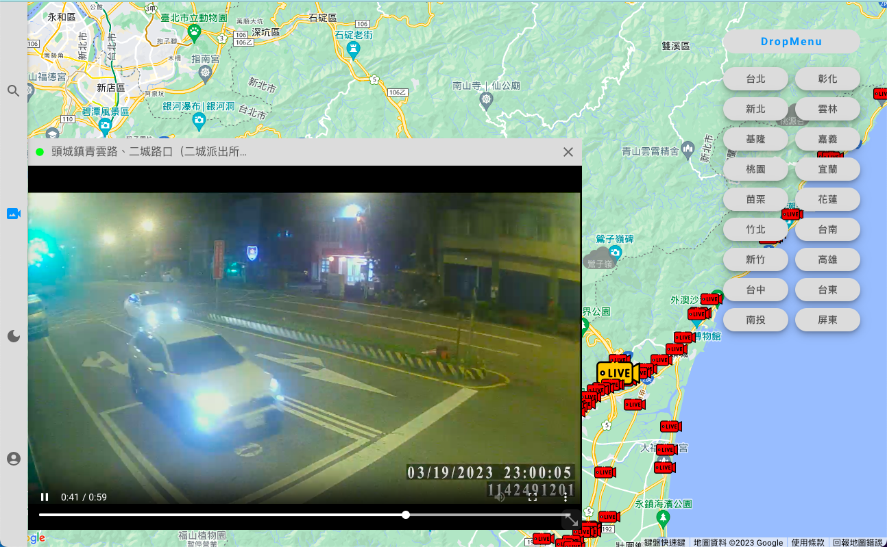

https://zzdx12345.github.io/CCTVS/

This project is designed for people who do not know where it's currently raining now or not 
You can easily type where you wanna go into the search bar, and all the cameras around your destination
would be show up and 
Alternatively you can select a city where you want to take a look via fabs 

Addition features

* SearchBar 
    "Users can easily find the destination through the search bar, all predictions or information are from Google"
* Dragging 
    "users are able to drag the video window to anywhere they want"
* Resizing 
    "users are able to resize the video window to any size they want"
* DarkMode 
    "switch between light and dark mode with the click of a button in the menu bar"
* RainAnimation 
    "there's a cloud would show up above, if it's currently raining now"
* RWD 
    "this project designed with full RWD"